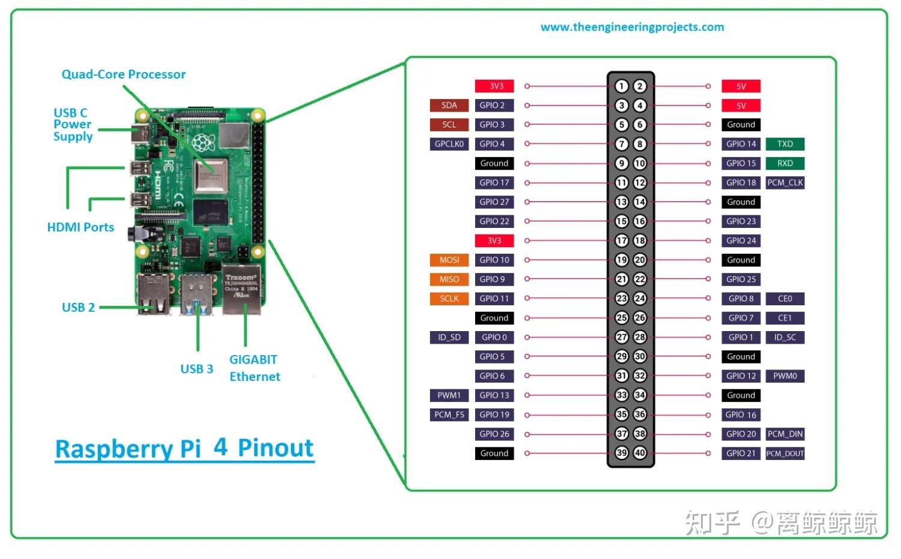

# 基于vsomeip的qnx系统开发

## 1. QNX SDP与树莓派镜像安装

首先交叉编译的环境在ubuntu x86宿主机中进行，所以申请非商业版本的SDP，下载安装时如非专业开发者请勿放在windows

QNX开源了树莓派的QNX8.0镜像，主要查看gitlab的[链接教程](https://gitlab.com/qnx/quick-start-images/raspberry-pi-qnx-8.0-quick-start-image)进行下载

记得准备一张32G的SD卡进行刷img镜像

## 2. 树莓派串口通信与SSH登录

### (1) 树莓派串口通信
树莓派4B的GPIO图如下



我使用的是PL2303  电脑连接USB 树莓派连接4 6 8 10引脚
PL2303应该是qnx和ubuntu都可以兼容的驱动

串口登录指令
```
sudo picocom /dev/ttyUSB0 -b 115200
```

### (2) 树莓派SSH通信
SSH登录需要设置，因为官方给的树莓派镜像权限需要修改，通过串口登录进去
```
find / -name sshd_config     
# 显示 /system/etc/ssh/sshd_config

vim /system/etc/ssh/sshd_config
# 修改成如下设置
# UsePAM no
# PasswordAuthentication yes

ifconfig
# genet0: ... inet 10.100.5.63 

# 然后根据ip即可通过ssh登录(ubuntu和树莓派在一个网段)
ssh root@10.100.5.63
```


## 3. vsomeip编译

这个地方最麻烦，因为需要交叉编译，还需要依赖boost库，开始搞了三四天，boost的版本需要打补丁，改配置，另外就是网络差（同步boost的子仓非常费时间）
最终还是按照了github链接使用了docker构建
https://github.com/qnx-ports/build-files/tree/main/ports/vsomeip

## 4. vscode qnx toolkit

具体可以查看[链接](https://www.bilibili.com/video/BV1VPdaYdEwV/?spm_id_from=333.337.search-card.all.click)

vscode设置里面搜索qnx.config.defaultProjectsRoot 配置${userHome}/qnxprojects即可
